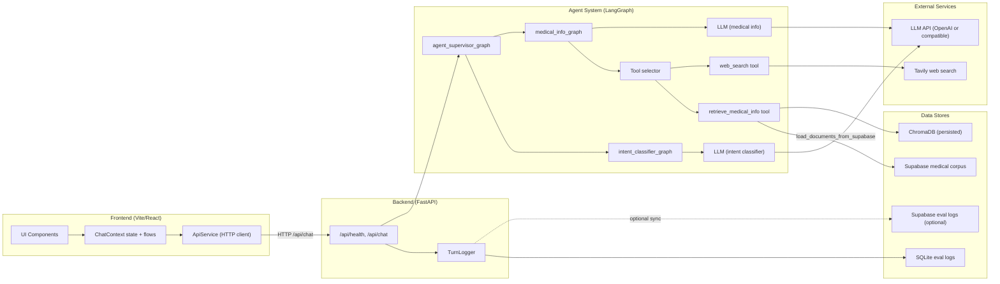

# Agent System Architecture Diagram

```mermaid
flowchart LR
  subgraph Frontend["Frontend (Vite/React)"]
    UI["UI Components"]
    ChatCtx["ChatContext state + flows"]
    ApiSvc["ApiService (HTTP client)"]
    UI --> ChatCtx --> ApiSvc
  end

  subgraph Backend["Backend (FastAPI)"]
    API["/api/health, /api/chat"]
    TurnLog["TurnLogger"]
    API --> TurnLog
  end

  subgraph AgentSystem["Agent System (LangGraph)"]
    Supervisor["agent_supervisor_graph"]
    Intent["intent_classifier_graph"]
    MedInfo["medical_info_graph"]
    ToolSelect["Tool selector"]
    Retriever["retrieve_medical_info tool"]
    WebSearch["web_search tool"]
    LLM1["LLM (intent classifier)"]
    LLM2["LLM (medical info)"]
    Supervisor --> Intent --> LLM1
    Supervisor --> MedInfo --> ToolSelect --> Retriever
    ToolSelect --> WebSearch
    MedInfo --> LLM2
  end

  subgraph DataStores["Data Stores"]
    SQLite["SQLite eval logs"]
    Chroma["ChromaDB (persisted)"]
    Supabase["Supabase medical corpus"]
    SupabaseLogs["Supabase eval logs (optional)"]
  end

  subgraph External["External Services"]
    Tavily["Tavily web search"]
    LLMAPI["LLM API (OpenAI or compatible)"]
  end

  ApiSvc -->|"HTTP /api/chat"| API
  API --> Supervisor
  TurnLog --> SQLite
  TurnLog -. optional sync .-> SupabaseLogs
  Retriever -->|"load_documents_from_supabase"| Supabase
  Retriever --> Chroma
  WebSearch --> Tavily
  LLM1 --> LLMAPI
  LLM2 --> LLMAPI
```
